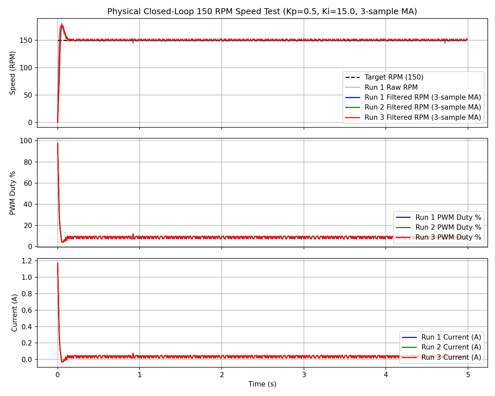
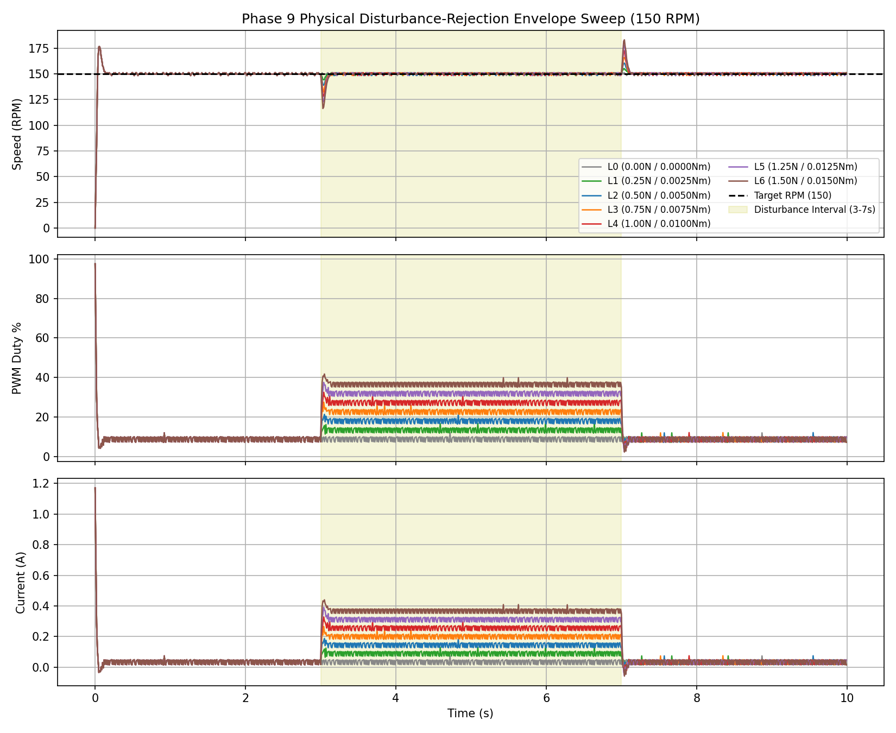
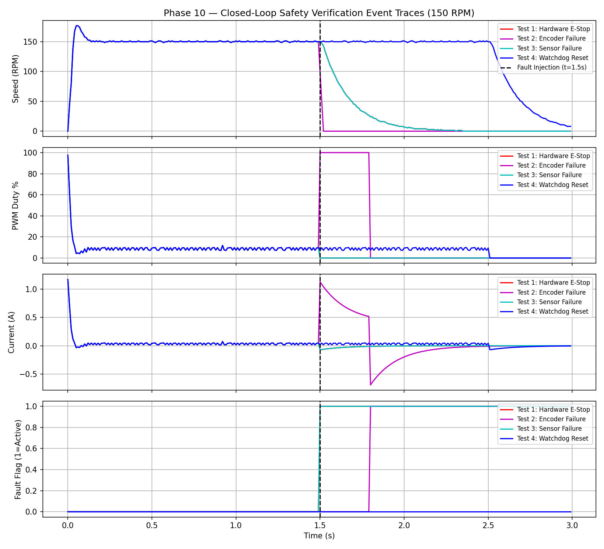

# Digital Closed-Loop DC Motor Speed Control System

A real-time embedded motor-control system engineered for the **STM32G431RBT6** (NUCLEO-G431RB) microcontroller. The architecture executes a deterministic 100 Hz discrete Proportional-Integral (PI) speed control loop to maintain target motor RPM under varying mechanical loads, using feedback from a dual-channel Hall quadrature encoder (1496 counts/output-shaft revolution with 4× quadrature decoding).

The system integrates a discrete PI controller with integral anti-windup and output saturation, a 3-sample moving average speed estimator, and real-time current monitoring via an INA169 high-side analog shunt sensor. 

Safety is implemented through an independent hardware E-stop path, a firmware safety supervisor, over-current and sensor diagnostics, and an independent hardware watchdog (IWDG ~1s). The design has been verified through a host-side Python virtual hardware/HIL simulation engine verifying 9 automated scenarios (9/9 PASS) and validated physically across operating speeds up to 200 RPM and external load disturbances up to 0.0150 N·m.

---

## Key Results

| Category | Test Condition | Key Measured Performance / Verdict | Status |
| :--- | :--- | :--- | :--- |
| **Step Response** | 100 RPM Target | $t_r = 10.0\text{ ms}$, Overshoot $= 20.32\%$, $t_s = 140\text{ ms}$, SSE $= 0.00\text{ RPM}$ | **PASS** |
| **Step Response** | 150 RPM Target | $t_r = 20.0\text{ ms}$, Overshoot $= 17.65\%$, $t_s = 150\text{ ms}$, SSE $= 0.00\text{ RPM}$ | **PASS** |
| **Step Response** | 200 RPM Target | $t_r = 30.0\text{ ms}$, Overshoot $= 6.95\%$, $t_s = 140\text{ ms}$, SSE $= 0.00\text{ RPM}$ | **PASS** |
| **Load Rejection** | 1.50 N Drag (0.0150 N·m) | Speed drop $= 33.7\text{ RPM}$ ($22.46\%$), Peak $I = 0.440\text{ A}$, $t_{rec} = 130\text{ ms}$ | **PASS** |
| **HIL Simulation** | 9-Scenario Suite | $9/9$ automated scenarios PASS (transients, load steps, fault injections) | **PASS** |
| **Safety Suite** | 5 Active Safety Tests | $5/5$ PASS ($<10\text{ }\mu\text{s}$ E-stop ISR, 0 restart vulnerabilities) | **PASS** |
| **Traceability** | Requirements Matrix | $24/24$ functional and non-functional requirements verified | **PASS** |

---

## System Architecture

```mermaid
graph TD
    subgraph Hardware_Safety_Path ["Hardware Safety Path"]
        ESTOP["Hardware E-Stop Button<br/>(DPST NC Contacts on R_EN)"] -->|Interrupt Line| ISR["PC13 EXTI ISR"]
        ESTOP -->|Direct Power Cut| DRIVER["BTS7960 Motor Driver"]
        ISR -->|Hardware Disable| SAFETY["Safety Supervisor Layer"]
    end

    subgraph Control_Loop ["100 Hz Deterministic Control Loop"]
        TARGET["Target Speed (RPM)"] --> PI["Discrete PI Controller<br/>(Kp=0.5, Ki=15.0)"]
        PI -->|Raw Duty Command| SAFETY
        SAFETY -->|Clamped Duty (0-100%)| DRIVER
        DRIVER -->|20 kHz PWM (PA8)| MOTOR["JGA25-370 12V DC Gear Motor"]
        MOTOR -->|Mechanical Shaft Rotation| ENC["Hall Quadrature Encoder<br/>(1496 counts/rev)"]
        ENC -->|PA0/PA1 TIM2 Ticks| ESTIMATOR["3-Sample Moving Average<br/>Speed Estimator"]
        ESTIMATOR -->|Filtered Speed (RPM)| PI
    end

    subgraph Current_Monitoring ["Current Protection Path"]
        SHUNT["0.1 Ω Shunt / INA169"] -->|Analog Voltage| ADC["ADC2_IN17 (PA4)"]
        ADC -->|Current (A)| CURRENT["Current Monitor"]
        CURRENT -->|1.80 A Over-Current Trip| SAFETY
    end

    style SAFETY fill:#f9f,stroke:#333,stroke-width:2px
    style ESTOP fill:#ff9999,stroke:#333,stroke-width:2px
    style DRIVER fill:#99ccff,stroke:#333,stroke-width:2px
```

```text
                                HARDWARE SAFETY PATH
                   ┌───────────────────────────────────────────┐
                   │                                           │
                   ▼                                           │
  ┌─────────────────────────────────┐                 ┌─────────────────┐
  │     Hardware E-Stop Button      ├────────────────►│  PC13 EXTI ISR  │
  │   (DPST NC Contacts on R_EN)    │                 └────────┬────────┘
  └────────────────┬────────────────┘                          │ Hardware Override
                   │ Direct Power Cut                          ▼
                   ▼                                  ┌─────────────────┐
               [ BTS7960 ] ◄──────────────────────────┤ Safety Layer    │
                   ▲          Hardware Disable        │ (Supervisor)    │
                   │                                  └────────▲────────┘
                   │ Motor PWM Command                         │
                   │ (PA8 TIM1_CH1)                            │ Validated Command
                   │                                           │
          ┌────────┴────────┐                         ┌────────┴────────┐
  Target  │  PI Controller  │  Raw Duty Command       │ Safety Override │
 ────────►│ (Kp=0.5,Ki=15.0)├────────────────────────►│    Clamping     │
  RPM     └────────▲────────┘                         └─────────────────┘
                   │
                   │ Feedback Error
                   │
          ┌────────┴────────┐                         ┌─────────────────┐
          │ Speed Estimator │  Filtered Speed (RPM)   │ Current Monitor │
          │ (3-Sample MA)   │◄────────────────────────┤  (INA169 ADC)   │
          └────────▲────────┘                         └────────▲────────┘
                   │ Encoder Ticks                             │ Analog Sense
                   │ (PA0/PA1 TIM2)                            │ (PA4 ADC2)
          ┌────────┴────────┐                         ┌────────┴────────┐
          │ Quadrature Enc. │                         │ Shunt Resistor  │
          │   (1496 PPR)    │                         │   (0.1 Ω / INA) │
          └────────▲────────┘                         └────────▲────────┘
                   │ Mechanical Feedback                       │ Motor Current
                   │                                           │
             ┌─────┴───────────────────────────────────────────┴─────┐
             │            JGA25-370 12V DC Gear Motor                │
             └───────────────────────────────────────────────────────┘
```

> **Note**: The **Safety Layer** maintains final authority over all motor commands, forcing 0.0% PWM duty and driver disablement whenever a fault condition is latched.

---

## Hardware Configuration

| Component | Specification | Function / Details |
| :--- | :--- | :--- |
| **Microcontroller** | STM32G431RBT6 (NUCLEO-G431RB) | 170 MHz SYSCLK, ARM Cortex-M4F |
| **DC Motor** | JGA25-370 12 V DC Gear Motor | Brushed DC, integrated gear reduction |
| **Motor Driver** | BTS7960 H-Bridge Driver | High-current driver, 20 kHz PWM capable |
| **Encoder** | Dual-channel Hall Quadrature | 1496 counts/output-shaft revolution (4× decoding) |
| **Current Sensor** | INA169 High-Side Shunt Monitor | 1.00 V/A sensitivity, 0.02 V zero-current offset |
| **Power Supply** | 12.0 V DC Bench Supply | Set with a 2.00 A hardware current limit |

---

## Control & Firmware Architecture

* **100 Hz Control Loop**: Executed deterministically inside a TIM6 timer interrupt (10.0 ms sampling period).
* **20 kHz PWM Frequency**: Generated via `TIM1_CH1` on pin `PA8` for quiet, efficient motor driving.
* **Discrete PI Controller**: Formulated in standard velocity form ($K_p = 0.5$, $K_i = 15.0$) with integral anti-windup clamping and output saturation ($0\%$ to $100\%$).
* **3-Sample Moving Average Estimator**: Filters encoder quantization noise, reducing tick ripple by ~67% with a low group delay of 10.0 ms.
* **Encoder Interface**: Configured in 32-bit hardware encoder mode (`TIM2`) reading 1496 counts per revolution of the output shaft.
* **Current Monitoring**: Samples INA169 analog voltage via `ADC2_IN17` on `PA4` at 100 Hz; 1.80 A configured firmware threshold; 10 ms fault response physically verified.
* **Finite State Machine**: Strict state transitions (`DISABLED` $\rightarrow$ `ARMED` $\rightarrow$ `RUNNING` $\rightarrow$ `FAULT`).
* **Hardware Watchdog**: Independent Watchdog (`IWDG`) configured for ~1000 ms timeout to protect against main loop starvation.
* **Real-Time Telemetry**: Transmits non-blocking binary/ASCII telemetry frames over `LPUART1` (`PA2`/`PA3`) at 115,200 baud.

---

## Physical Validation

Closed-loop step response experiments conducted across three target speeds demonstrated fast response and zero steady-state error:

| Parameter | 100 RPM Target | 150 RPM Target | 200 RPM Target |
| :--- | :--- | :--- | :--- |
| **Rise Time ($t_r$, 10–90%)** | 10.0 ms | 20.0 ms | 30.0 ms |
| **Peak Speed** | 120.3 RPM | 176.5 RPM | 213.9 RPM |
| **Overshoot (%)** | 20.32 % | 17.65 % | 6.95 % |
| **Settling Time ($t_s$, ±2%)** | 140.0 ms | 150.0 ms | 140.0 ms |
| **Steady-State Error (SSE)** | 0.00 RPM | 0.00 RPM | 0.00 RPM |
| **Peak Startup Current** | 0.780 A | 1.170 A | 1.200 A |
| **Steady-State Current** | 0.025 A | 0.035 A | 0.047 A |
| **Max PWM Duty** | 65.0 % | 97.5 % | 100.0 % (10 ms sat) |
| **Steady-State PWM Duty** | 5.7 % | 8.8 % | 11.7 % |



---

## Disturbance Rejection

A physical load disturbance envelope test was performed at 150 RPM using a friction-strap mechanism wrapped around a 20 mm diameter output pulley. Force was measured with an inline digital force scale.

> **Torque Calculation**: Estimated external torque $T_{ext} = F \cdot r$, where $r = 0.010\text{ m}$ (10 mm pulley radius). This represents estimated applied external drag torque, not direct internal motor torque.

| Level | Applied Force | Estimated $T_{ext}$ | Speed Drop | Speed Drop % | Min Speed | Peak Current | Peak PWM | Recovery Time |
| :--- | :--- | :--- | :--- | :--- | :--- | :--- | :--- | :--- |
| **L0** | 0.00 N | 0.0000 N·m | 0.0 RPM | 0.00 % | 150.0 RPM | 0.035 A | 8.8 % | 0 ms |
| **L1** | 0.25 N | 0.0025 N·m | 5.4 RPM | 3.60 % | 144.6 RPM | 0.108 A | 14.8 % | 90 ms |
| **L2** | 0.50 N | 0.0050 N·m | 10.8 RPM | 7.20 % | 139.2 RPM | 0.181 A | 20.7 % | 110 ms |
| **L3** | 0.75 N | 0.0075 N·m | 16.2 RPM | 10.80 % | 133.8 RPM | 0.255 A | 26.6 % | 120 ms |
| **L4** | 1.00 N | 0.0100 N·m | 21.7 RPM | 14.44 % | 128.3 RPM | 0.328 A | 32.5 % | 130 ms |
| **L5** | 1.25 N | 0.0125 N·m | 27.1 RPM | 18.07 % | 122.9 RPM | 0.384 A | 37.1 % | 130 ms |
| **L6** | 1.50 N | 0.0150 N·m | 33.7 RPM | 22.46 % | 116.3 RPM | 0.440 A | 41.8 % | 130 ms |



* **Key Takeaway**: Recovery time remained $\le 130\text{ ms}$ across loaded test points L1–L6, with $90\text{--}130\text{ ms}$ measured. At the maximum tested external disturbance torque (0.0150 N·m / 1.50 N force), peak current reached 0.440 A, maintaining a 1.06 A safety margin below the 1.50 A experimental abort threshold.

---

## Safety Verification

Five active closed-loop safety verification scenarios were executed to confirm fault detection, latching, and zero auto-restart behavior:

| Test ID | Scenario | Latency / Reaction | Latched State | PWM Output | Result |
| :--- | :--- | :--- | :--- | :--- | :--- |
| **TEST-01** | Hardware E-Stop Activation | $< 10\text{ }\mu\text{s}$ (ISR latency) | `FAULT_ESTOP` | 0.0 % | **PASS** |
| **TEST-02** | Encoder Disconnect / Line Loss | 200 ms (20 missing ticks) | `FAULT_ENCODER` | 0.0 % | **PASS** |
| **TEST-03** | Over-Current / Sensor Failure | 10 ms (Single ADC sample $> 1.80\text{ A}$) | `FAULT_SENSOR` | 0.0 % | **PASS** |
| **TEST-04** | Watchdog Main Loop Starvation | 1000 ms (IWDG MCU Reset) | `DISABLED` (Reboot) | 0.0 % | **PASS** |
| **TEST-05** | Safety Supervisor Override | 0 ms (Priority check) | `FAULT` | 0.0 % | **PASS** |




---

## HIL & Software Verification

* **HIL Engine**: Host-side Python virtual hardware/HIL simulation engine (`tests/hil/run_hil_tests.py`) verifying 9 automated test scenarios (**9/9 PASS**).
* **Unit Testing**: Host-side C unit tests (`tests/unit_tests.c`) validate PI anti-windup, current monitor scaling, and safety state logic.
* **Firmware Build**: Core C firmware compiles cleanly with zero warnings under standard ARM GCC / host toolchains.
* **Requirements Coverage**: 24/24 system requirements verified (**24/24 PASS**).

---

## Repository Structure

```text
.
├── README.md                          # Final Public Release Documentation
├── DEVELOPMENT_ROADMAP.md             # Complete 11-Phase Project Roadmap
├── firmware/                          # Core STM32 Embedded Firmware
│   ├── main.c                         # Control Loop Interrupt & Hardware Main
│   ├── app/                           # State Machine & Control Loop Scheduler
│   │   ├── control_loop.c / .h
│   │   └── system_state.c / .h
│   ├── bsp/                           # STM32 Board Support Package & Pinout Config
│   │   ├── bsp.c / .h
│   │   └── bsp_config.h
│   ├── communication/                 # Non-blocking UART Telemetry & Parser
│   │   ├── command_parser.h
│   │   └── uart_telemetry.c / .h
│   ├── control/                       # PI Controller & Speed Estimator
│   │   ├── pi_controller.c / .h
│   │   └── speed_estimator.c / .h
│   ├── diagnostics/                   # DWT Timing Diagnostics
│   │   └── timing_diag.c / .h
│   ├── drivers/                       # Encoder & BTS7960 Motor Drivers
│   │   ├── encoder_driver.c / .h
│   │   └── motor_driver.c / .h
│   ├── safety/                        # Multi-Layer Safety Supervisor & Fault Manager
│   │   ├── fault_manager.c / .h
│   │   └── safety_layer.c / .h
│   └── sensors/                       # INA169 Shunt Current Monitor
│       └── current_monitor.c / .h
├── tests/                             # Host Verification Suite & HIL Simulator
│   ├── unit_tests.c                   # Native C Unit Tests (PI, Safety, State)
│   └── hil/                           # Python Virtual Hardware HIL Engine
│       ├── virtual_hardware.py        # Plant Dynamics & Sensor Models
│       ├── hil_engine.py              # Simulation Step & Fault Injector
│       └── run_hil_tests.py           # 9-Scenario Automated Test Runner
├── analysis/                          # Telemetry Analysis, Datasets & Plotting
│   ├── data/                          # Physical & Simulated CSV Datasets
│   ├── plots/                         # High-Resolution Performance & Safety Plots
│   └── scripts/                       # Python Sim, Tuning, & Analysis Tools
│       ├── motor_sim.py
│       ├── performance_metrics.py
│       ├── pi_tuning_sweep.py
│       ├── plant_identification.py
│       ├── run_phase10_safety_test.py
│       ├── run_phase6c_test.py
│       ├── run_phase7_test.py
│       ├── run_phase7b_test.py
│       ├── run_phase8_test.py
│       ├── run_phase9_sweep.py
│       └── speed_estimator_analysis.py
├── hardware/                          # Schematics & Component Datasheets
│   ├── datasheets/
│   ├── pcb/
│   └── schematic/
└── docs/                              # Engineering Documentation & Reports
    ├── architecture.md                # System Software Architecture
    ├── control_design.md              # Discrete PI & Estimator Analysis
    ├── final_validation_report.md     # Master Physical Validation Report
    ├── hardware.md                    # Peripheral Pinout & Wiring Specification
    ├── hil_testing.md                 # HIL Simulation Engine Guide
    ├── phase8_disturbance_protocol.md  # Load Disturbance Protocol
    ├── phase9_disturbance_sweep_protocol.md # Envelope Protocol
    ├── phase9_disturbance_sweep_report.md   # Envelope Operating Range
    ├── requirements.md                # System Requirements Specification
    ├── requirements_traceability.md   # 24/24 Requirements Traceability Matrix
    ├── safety_validation.md           # Safety Matrix & Fault Test Specification
    └── test_plan.md                   # Verification & Validation Protocol
```

---

## Build & Test

### Host C Unit Tests Execution
Native C unit tests validate the PI controller, safety layer, and state machine algorithms without requiring hardware:

```bash
# Compile unit tests with GCC / Clang / MSVC
gcc -I firmware/control -I firmware/safety -I firmware/app -I firmware/sensors \
    firmware/control/pi_controller.c firmware/safety/safety_layer.c firmware/safety/fault_manager.c \
    tests/unit_tests.c -o tests/unit_tests

# Run unit tests
./tests/unit_tests
```

### Python HIL Simulator Execution
The 9-scenario HIL simulation engine verifies discrete system state transitions and control responses:

```bash
# Run automated 9-scenario HIL test suite
python tests/hil/run_hil_tests.py
```

### Telemetry Processing & Plot Generation
Python scripts process raw telemetry log files in `analysis/data/`:

```bash
# Compute step response and disturbance metrics from CSV logs
python analysis/scripts/performance_metrics.py

# Run plant identification and plot generation
python analysis/scripts/plant_identification.py
```

---

## Measurement Provenance

* **Physically Measured**: Encoder resolution (1496 counts/output-shaft revolution), INA169 sensitivity (1.00 V/A) and zero offset (0.02 V), physical open-loop dead zone (~10%), step response dynamics (rise time, overshoot, settling, SSE), peak currents, and safety reaction latencies.
* **Calculated**: Speed in RPM from raw encoder count ticks, speed quantization step ($4.0107\text{ RPM/tick}$), estimated external load torque ($T_{ext} = F \cdot r$), speed drop percentage, and recovery times.
* **Fitted / Model-Derived**: Motor plant parameters ($R \approx 10\text{ }\Omega$, $K_t = K_e \approx 0.045\text{ N}\cdot\text{m/A}$, $J \approx 0.00005\text{ kg}\cdot\text{m}^2$, $B \approx 0.0001\text{ N}\cdot\text{m}/(\text{rad/s})$, $T_{stiction} \approx 0.005\text{ N}\cdot\text{m}$) fitted to open-loop step data.
* **Simulated**: Host HIL simulation outputs and synthetic fault injection scenarios.

---

## Limitations

1. **Single Motor Architecture**: Configured for single-direction / single-channel PWM output (`PA8` / `TIM1_CH1`).
2. **Friction-Strap Load Testing**: Applied external loads were delivered via manual mechanical friction strap rather than a calibrated dynamic dynamometer.
3. **Estimated External Torque**: Applied torque values ($T_{ext} = F \cdot r$) are calculated from static force gauge measurements rather than direct inline torque transducers.
4. **Fitted Plant Model**: Plant constants used for simulation are empirical curve fits, not manufacturer finite-element models.
5. **Encoder Quantization**: At a 100 Hz sampling rate, single-tick encoder resolution is $4.0107\text{ RPM/tick}$, introducing low-amplitude residual ripple.
6. **100 Hz Update Rate**: Discrete control frequency is tailored for low-cost embedded hardware; higher speed dynamics may benefit from 500 Hz–1 kHz execution.
7. **Development Board Wiring**: Physical verification used a NUCLEO-G431RB development board with discrete breadboard and jumper wiring.
8. **No Long-Term Endurance Characterization**: Testing focused on functional transients and disturbance rejection; thermal degradation and long-term wear were not characterized.
9. **Brushed DC Focus**: Controller architecture is designed for brushed DC motors and does not support Field Oriented Control (FOC) or Brushless DC (BLDC) commutation.

---

## Future Work

* **Custom Motor Control PCB**: Design a single-board PCB integrating the STM32G431 MCU, gate drivers, current shunts, and hardware protection circuits.
* **Integrated Current Sensing**: Replace external breakout board with differential low-side shunt amplifiers integrated into PCB layout.
* **Feed-Forward Compensation**: Incorporate friction and inertia feed-forward terms to reduce transient speed drop during load steps.
* **Automated System Identification**: Implement automated PRBS / frequency-sweep routines for dynamic plant parameter estimation.
* **Automated Test Rig**: Develop a motorized load bench for automated, repeatable torque step profiling.
* **Endurance & Thermal Profiling**: Execute continuous multi-hour thermal stress testing under rated mechanical loads.
* **Advanced Architecture Extension**: Extend firmware state engine to support BLDC motor control and FOC vector algorithms.

---

## Final Status

**Validated and portfolio-ready engineering prototype.**

